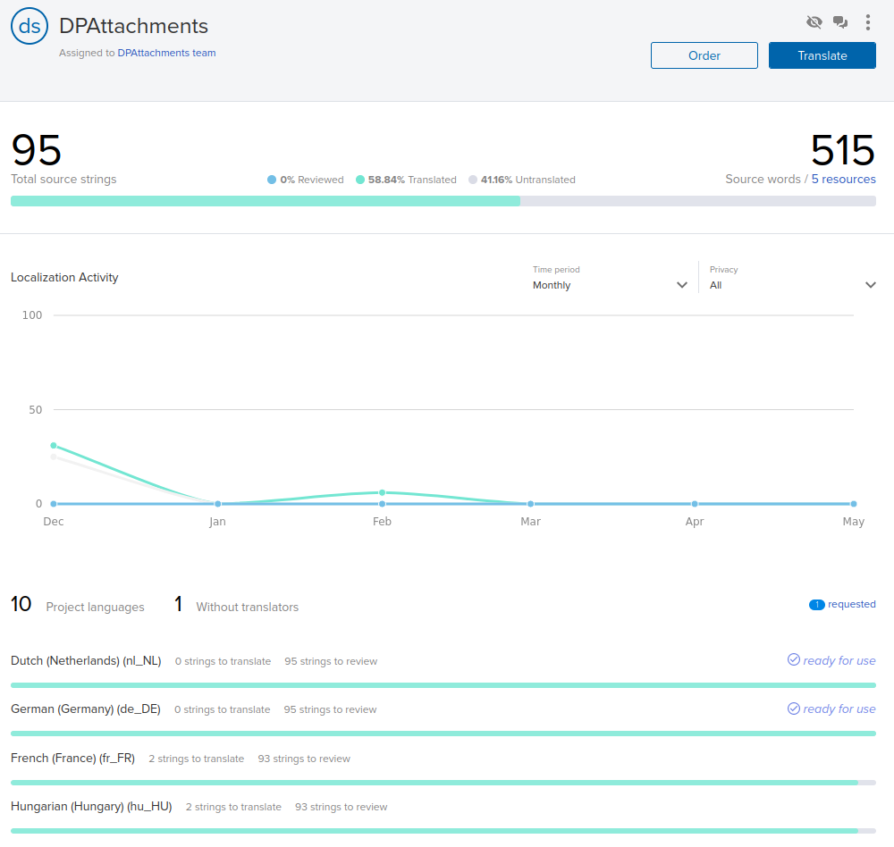

### Introduction
The DPAttachments Joomla attachment extension uses Transifex to maintain all available language translations. Transifex provides easy to use online tools, which can be used to update translations easily and without any in-depth or technical knowledge. Alternatively, Transifex allows you to download the current translation and update it with your favorite tool. It also allows anyone to download the most current version of any translated file.

Having your language in Transifex is the only way to get it into DPAttachments.

### Language files
Every extension shipped with the DPAttachments package has a language folder where the translations/language files are located. For example, if you want to translate the DPAttachments frontend into your language, copy the file /components/com_dpattachments/language/en-GB/en-GB.com_dpattachments.ini to /components/com_dpattachments/language/it-IT/it-IT.com_dpattachments.ini and translate the English strings inside the double quotes.

### Language overrides
The strings in DPAttachments are loaded through the Joomla language manager. Joomla offers to overwrite these strings in the language manager of Joomla itself. More information can be found [here](https://docs.joomla.org/J4.x:Language_Overrides_in_Joomla).

Note: Most of the language strings of DPAttachments are in the administration part. So you need to make them for the location Administrator and do tick for both locations.

### Join Transifex
Please follow the following steps to add your translation to DPAttachments.

1. **Register**  
You can register at https://www.transifex.com. Please use your username you are using on joomla.digital-peak.com!
2. **DPAttachments on Transifex**  
You can find DPAttachments under this URL: https://app.transifex.com/digital-peak/DPAttachments
3. **Create the language**  
Please create your language if there is no one yet. Please use the five digit xx_XX language code instead of the two digit language code. Or start translating a specific language right now.
4. **Doing the translation**  
Go back to the mainpage of the DPAttachments project page: https://app.transifex.com/digital-peak/DPAttachments. There you can see a list of the language files. To translate one of those just click on it. On the next side you can see some additional info and below is a list of the available languages. If your language is not listed, just click on add Translation and choose your language. If your language is available, you can click on it. Now you get a popup with some options. You can upload your local .ini file and Transifex will find the translations automatically or you can click on Translate now. When you press on Translate now you get a new view with all strings which are translated or should be translated. Just fill your translations into the text fields and press save. Your done with this file, go to the next ;)

For further information visit [docs.transifex.com](https://docs.transifex.com).

#### Warnings
_**Please test that your language works in Joomla! before uploading the file into Transifex. Otherwise your translations may break during import!**_

There are some bugs in Transifex Joomla support, so please check these:
- **NEVER** use double quotes (") in your translation; use single quotes instead (also in HTML tags)
- If you edit files by hand, make sure that it uses **Unix encoding** (\n), not Windows (\r\n) or Mac (\r) before uploading the files back to Transifex
- If you edit files by hand, make sure that you don't split the translations into more than one line (part of the translation disappears)
